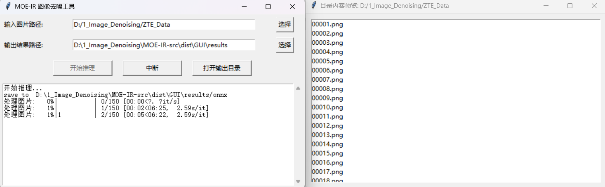
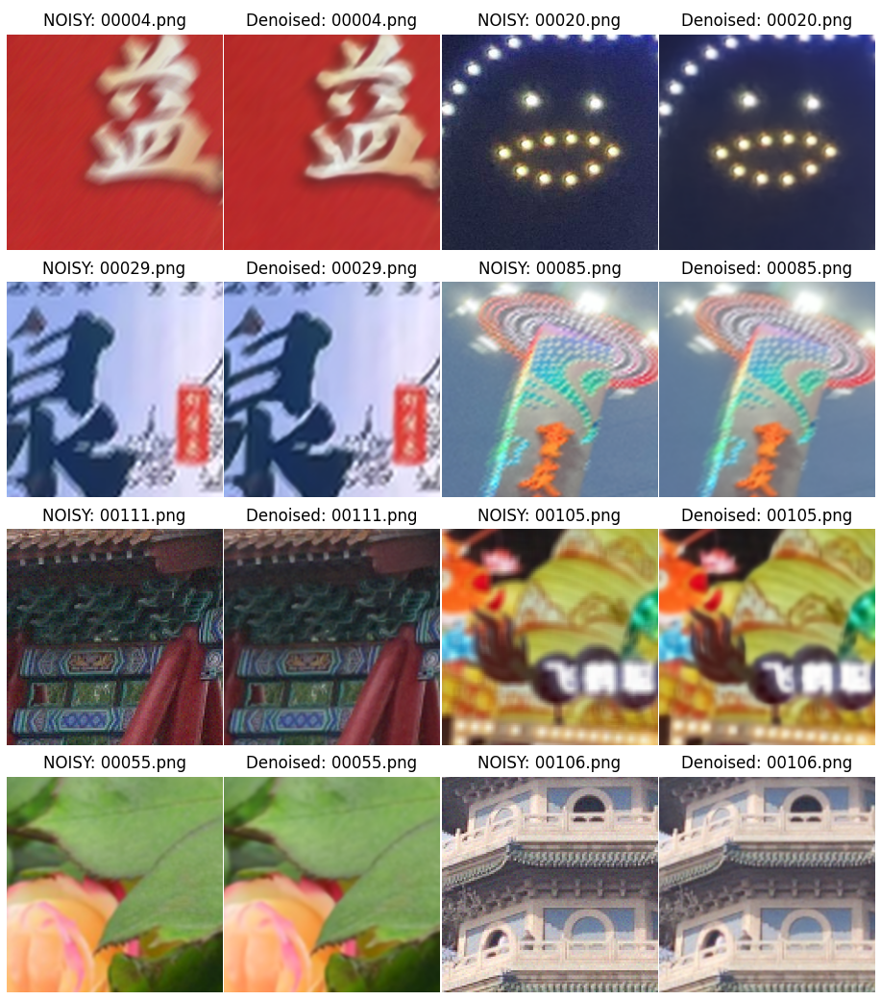

# MOE-IR_30G 算法运行说明文档

## 模型概述
如图所示，这是一个采用了U形架构的模型，具有非对称的编码器-解码器设计。
首先用一个 3×3 卷积从退化的输入中提取浅层特征，然后这些特征会经过四个层级的编码和解码阶段。
这两个阶段都使用了 Transformer 模块，并将一个新颖的混合复杂度专家（MoCE）层 集成到了解码器模块中。
为了进一步增强解码器的特征丰富化能力，本文用一个尺寸为3×3，中心值为8，其余位置全为-1的Sobel滤波器提取全局特征向量，从而引入高频引导， 以提升门控函数的频域感知能力。
最后，一个全局残差连接将浅层特征与细化模块的输出相连，在生成修复图像之前对关键的高频细节进行细化。


## 运行说明
操作系统为Windows 11 <br>
进入项目目录:
````
cd MOE-IR-src
````
创建一个conda环境:
````
conda create -n moeir python=3.9
conda activate moeir
````
安装依赖包<br>
如果仅需使用onnx模型进行推理测速，执行以下命令
````
pip install -r requirements.txt
````
requirements.txt不包含torch、torchvision和lightning，如果需要使用pytorch模型进行推理测试或者训练，需要进一步安装完整环境，命令如下：<br>
安装pytorch(根据实际情况选择cuda版本)
````
pip install torch torchvision --index-url https://download.pytorch.org/whl/cu126
````
安装lightning和ptflops
````
pip install lightning==2.0.1
pip install ptflops==0.7.4
````

### **模型推理**
#### 使用ONNX模型进行推理（推荐，PSNR结果优于pytorch模型推理）：
##### CMD方式
--data_file_dir 为待推理的图片路径，请将所有待推理的图片直接放在该文件夹中，**并修改为你的路径**<br>
结果会保存在**results/onnx**文件夹中
````
python src/run_onnx.py  --data_file_dir D:/1_Image_Denoising/ZTE_Data 
````
##### GUI方式
选择输出和输出文件夹，点击推理按钮即可。<br>
结果会保存在<b><输出路径>/onnx</b>文件夹中
````
python src/GUI.py
````
为了便于快速测试，我还打包了一份exe，免去环境配置的麻烦，直接点击GUI/GUI.exe文件运行程序即可…^—^…<br><br>

输入或者选择待推理图片文件夹和输出路径后点击开始推理按钮即可！

#### Notes:
- 由于模型中使用了rearrange和enisum等操作，转换成动态输入不方便，因此是以1920x1080为输入尺寸进行转换ONNX的，
对于其它尺寸的输入进行了预处理，处理成了1920x1080的尺寸输入ONNX模型，相关的处理逻辑可以查阅run_onnx.py，里面有详细注释。
- 对于官方给定的150张测试图片，在AMD 9600x处理器上推理耗时约6分半钟，内存占用约为7.4G。
- **可能发生的问题:** 锐龙9000系处理器在Windows 11操作系统上可能会出现全黑的推理结果，暂时不知道什么原因，因此加入了异常检测，如果检测到全黑输出，则重试推理。经测试，在Windows 10 和 Ubuntu22.04 操作系统上没有这个问题。


#### 使用pytorch模型进行推理：
--data_file_dir 为待推理的图片路径，请将所有待推理的图片直接放在该文件夹中，**并修改为你的路径**<br>
结果会保存在**results/MoCE_IR_30G**文件夹中
````
python src/inference.py --model MoCE_IR_30G --data_file_dir D:/1_Image_Denoising/ZTE_Data 
````


### **模型训练**
#### step1: 准备数据集
所用到的数据集及其下载链接已放置在datasets目录下，请根据里面提供的链接和指引下载数据集<br>
#### step2: 训练模型<br>
训练模型的命令如下：<br>

`````
python src/my_train.py --model MoCE_IR_30G \
--de_type sidd nind deblur redblur redblurjpeg denoise_15 denoise_25 denoise_50 poisson_1 \
--data_file_dir datasets \
--hdf5_path datasets/all_data_optimized.h5 --num_gpus 1 \
--loss_type multi_vgg --vgg_loss_weight 0.5 --loss_fn L1 --pixel_loss_weight 1.5 \
--ms_ssim_loss --ms_ssim_weight 0.7 --aux_l2_loss --aux_l2_weight 0.1 \
--use_fft_loss --fft_loss_fn L1 --fft_loss_weight 0.1 --balance_loss_weight 0.05 \
--batch_size 32 --patch_size 128  --lr 2e-4 --epochs 100 \
--ckpt_dir src/checkpoints --num_workers 6 --val_file_dir datasets/ZTE_Example \
--exp_name exp1
`````

--data_file_dir 为数据集路径<br>
--hdf5_path 为了加速训练，将数据集转换为hdf5格式后存放的路径<br>
--num_gpus 为使用的GPU数量<br>
--de_type 为退化类型，可选择sidd nind deblur redblur redblurjpeg denoise_15 denoise_25 denoise_50 poisson_1<br>
--ckpt_dir 为模型保存路径<br>
--val_file_dir 为验证集路径<br>
--loss_type 为损失函数类型，可选择multi_vgg vgg L1<br>
--vgg_loss_weight 为VGG损失权重<br> 
--loss_fn 为损失函数，可选择L1 L2<br>
--pixel_loss_weight 为像素损失权重<br>
--ms_ssim_loss 为是否使用MS-SSIM损失<br>
--ms_ssim_weight 为MS-SSIM损失权重<br>
--aux_l2_loss 为是否使用辅助L2损失<br>
--aux_l2_weight 为辅助L2损失权重<br>
--use_fft_loss 为是否使用FFT损失<br>
--fft_loss_fn 为FFT损失函数，可选择L1 L2<br>
--fft_loss_weight 为FFT损失权重<br>
--balance_loss_weight 为平衡损失权重<br>
--batch_size 为batch大小<br>
--patch_size 为patch大小<br>
--lr 为学习率<br>
--epochs 为训练轮数<br>
--num_workers 为数据加载线程数<br>
--val_file_dir 为验证集路径<br>
--exp_name 为实验名称<br>

#### step3：训练过程监控<br>
训练过程中会在logs目录下生成一个logs文件夹，里面存放了训练过程中的日志文件，可使用tensorboard可视化训练过程<br>
````
tensorboard --logdir=/logs/<exp_name>/lightning_logs/version_0
````
<exp_name> 为训练过程中的实验名称

### **各个代码文件作用简介**
src文件夹下的文件作用如下：
- **inference.py**：用于进行模型推理的脚本。
- **my_train.py**：用于训练模型的脚本。
- **run_onnx.py**：用于将PyTorch模型转换为ONNX格式并进行推理的脚本。
- **export_onnx.py**：用于将PyTorch模型转换为ONNX格式的脚本。
- **options.py**：用于输入模型选项和参数的脚本，即args。
- **gen_datasets_list.py**：用于生成数据集列表csv文件的脚本，用的是相对路径，所有列表文件已经放置datasets文件夹下，可以不用重新生成。
- **plot_pic.py**：用于绘制结果对比图像的脚本。
- **model.onnx**：导出的ONNX模型文件。
- **GUI.py**：用于提供ONNX推理的GUI界面的脚本。

src/checkpoints文件夹下的文件作用如下：
- **MoCE_IR_30G**：保存训练好的模型权重文件。
- **MoCE_IR_30G/last.ckpt**：保存训练好的pytorch模型权重文件。
- **MoCE_IR_30G/hparams.yaml**：保存训练过程中的超参数配置文件。

src/data文件夹下的文件作用如下：
- **dataset_utils.py**：数据集类，加载和预处理数据。
- **degradation_utils.py**：退化函数，用于添加噪声。

src/net文件夹下的文件作用如下：
- **moce_ir.py**：模型定义。

src/utils文件夹下的文件作用如下：
- **image_utils.py**：图像处理辅助函数
- **pytorch_ssim/__init__.py**：结构相似性计算
- **schedulers.py**：学习率调度策略
- **test_utils.py**：测试评估工具集
- **val_utils.py**：验证指标计算
- **weight_schedule.py**：动态权重调整
- **loss_utils.py**：损失函数定义。

### **部分结果**


### **致谢**
本代码基于[MoCE-IR](https://github.com/eduardzamfir/MoCE-IR/tree/main) 和 [AirNet](https://github.com/XLearning-SCU/2022-CVPR-AirNet)构建，感谢原作者们的工作！

